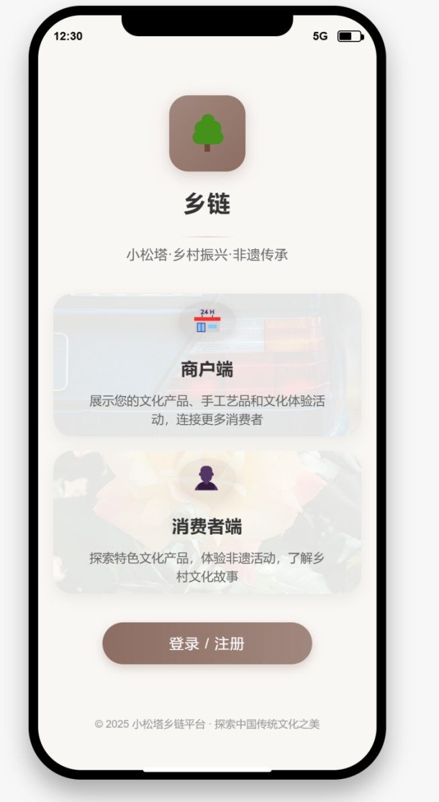
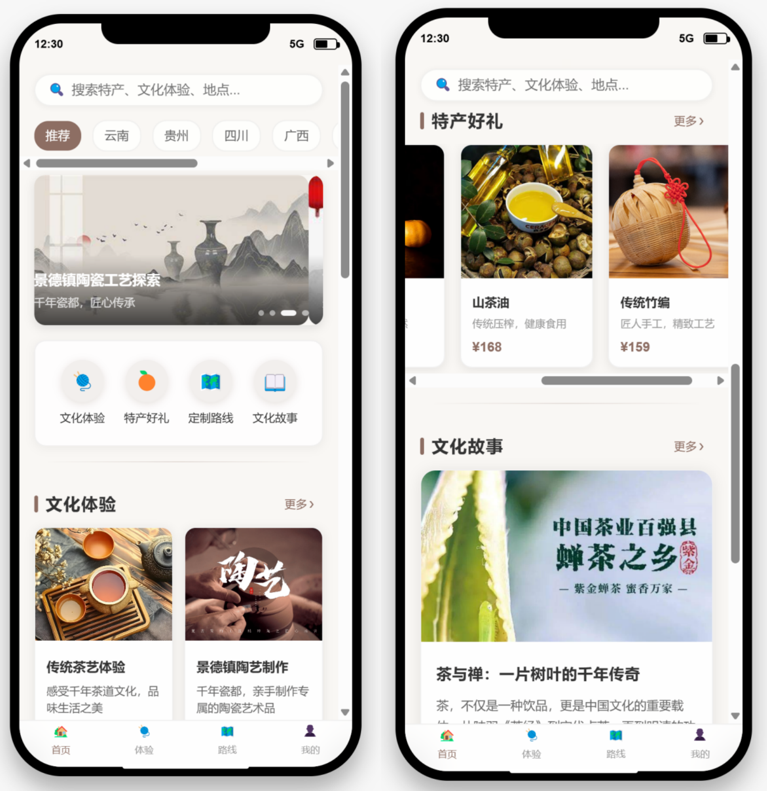
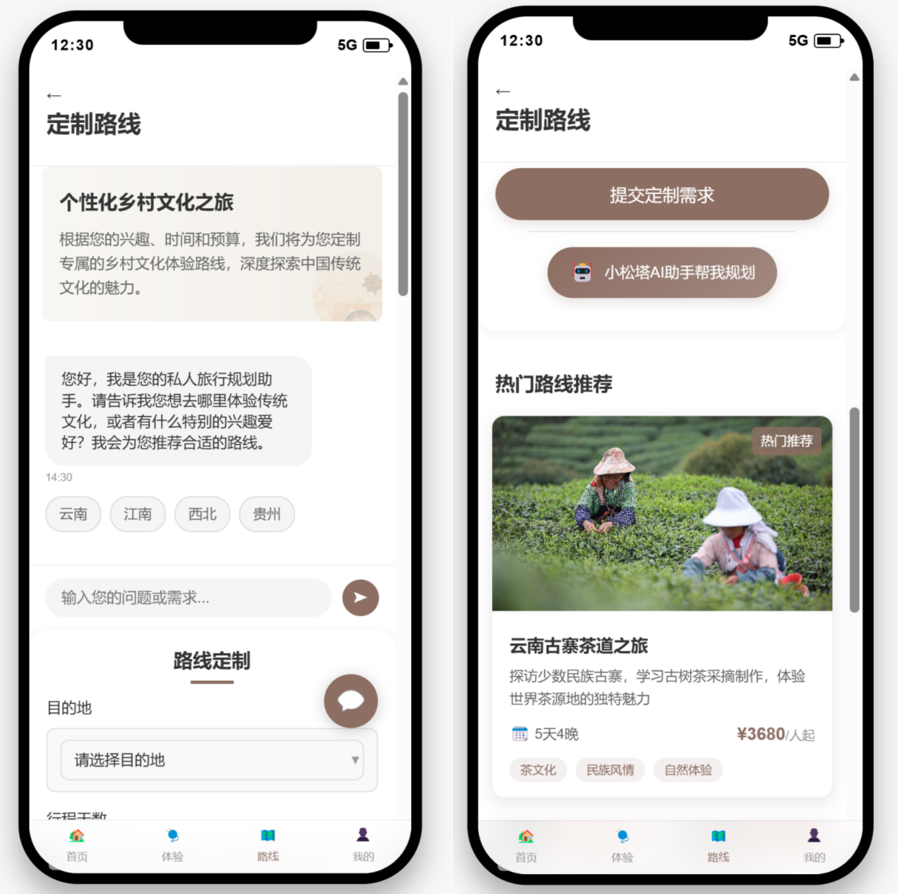
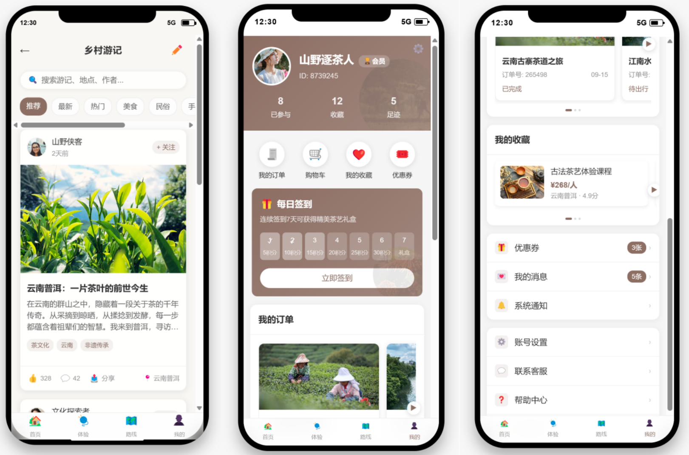
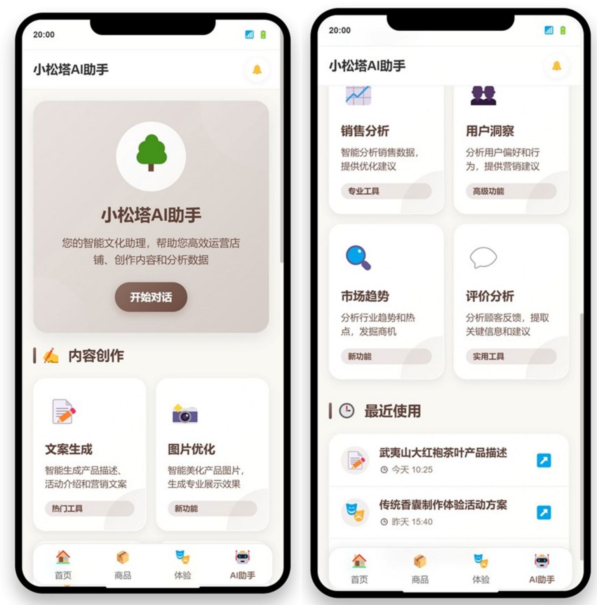
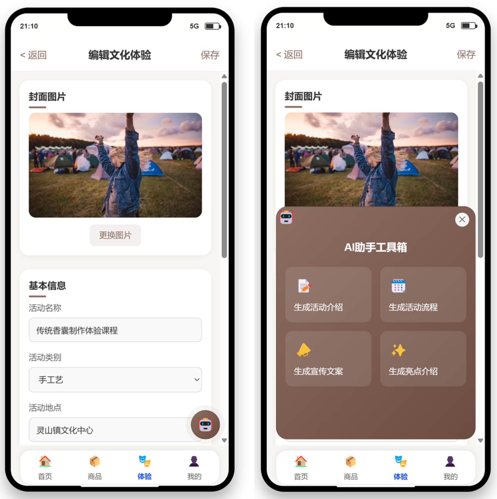
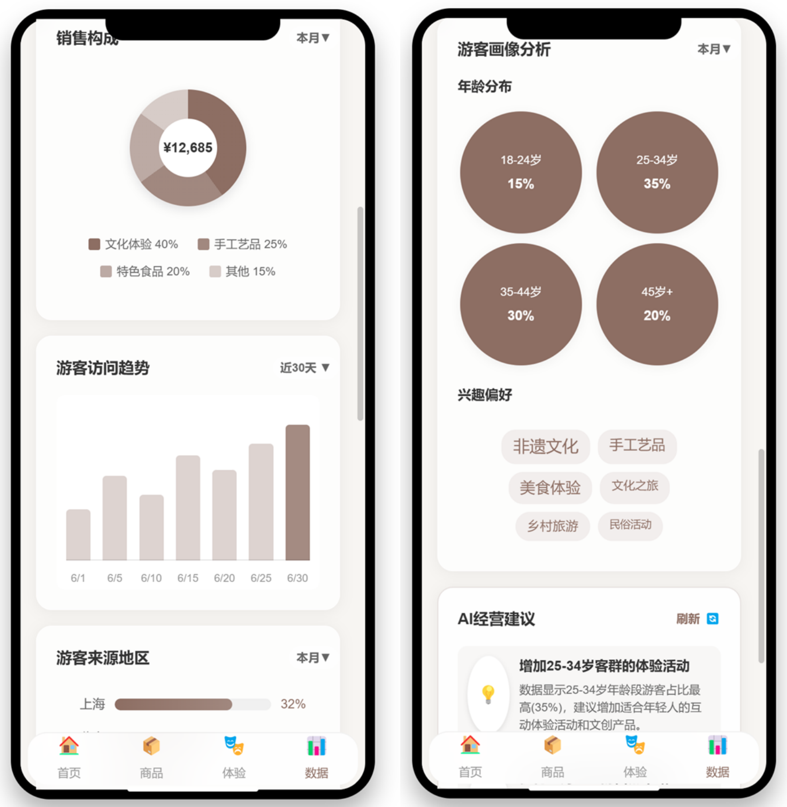

# 乡链 - 城乡文化直连H5页面项目

## 1. 项目简介

**乡链**是一个旨在连接城乡文化的H5移动端平台。我们致力于为城市消费者提供真实、地道的乡村文化产品和深度体验，同时为乡村商户提供一个展示和销售其独特文化资源的高效渠道。

此项目包含平台的核心前端页面，分为**消费者端**和**商户端**，完整地展示了从浏览、体验、购买到管理、分析的全流程功能。

## 2. 核心功能模块

### 2.1. 消费者端 (Consumer)

为用户提供一个探索、体验和购买乡村文化产品的窗口。

- **首页 (`1_index.html`)**: 集合了平台的核心入口，包括内容推荐、搜索、分类导航和功能分区。
- **文化体验 (`cultural-experience.html`)**: 用户可以浏览、筛选和搜索不同种类的文化体验活动。
- **非遗好物 (`cultural-products.html`)**: 展示和销售具有非物质文化遗产属性的特色商品。
- **商品详情 (`product-detail.html`)**: 提供详细的商品信息、文化故事、用户评价等。
- **订单确认 (`order-confirmation.html`)**: 便捷的下单与支付流程。
- **定制路线 (`custom-route.html`)**: 用户可以根据个人兴趣定制专属的文化旅游路线，或通过AI助手获取智能规划。
- **乡村游记 (`rural-stories.html`)**: 用户可以浏览和发布关于乡村文化和旅行的故事。
- **个人中心 (`user-center.html`)**: 管理个人信息、订单、收藏和优惠券等。

### 2.2. 商户端 (Merchant)

为乡村文化商户提供一套完整的店铺管理和运营工具。

- **登录选择 (`login-selection.html`)**: 提供商户和消费者的入口分流。
- **数据分析 (`analytics.html`)**: 以图表化方式展示店铺的关键运营数据，如总收入、订单量、客户分析等。
- **商品与特产管理 (`specialty.html`)**: 方便商户上架、编辑和管理其特色产品。
- **体验管理 (`experiences.html`, `experience-edit.html`)**: 管理文化体验活动的发布、编辑和查询。
- **订单管理 (`orders.html`)**: 集中处理来自商品、体验和民宿等不同类型的订单。
- **小松塔AI助手 (`ai-tools.html`)**: 集成了内容创作（如文案生成）和数据分析的智能工具，辅助商户高效运营。

## 3. 核心页面预览

#### 登录选择页

#### 消费者端核心页面

##### 首页

##### 路线定制页

##### 用户运营体系

#### 消费者端核心页面

##### AI工具页

##### 内容编辑页

##### 数据分析页

